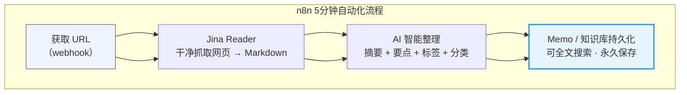
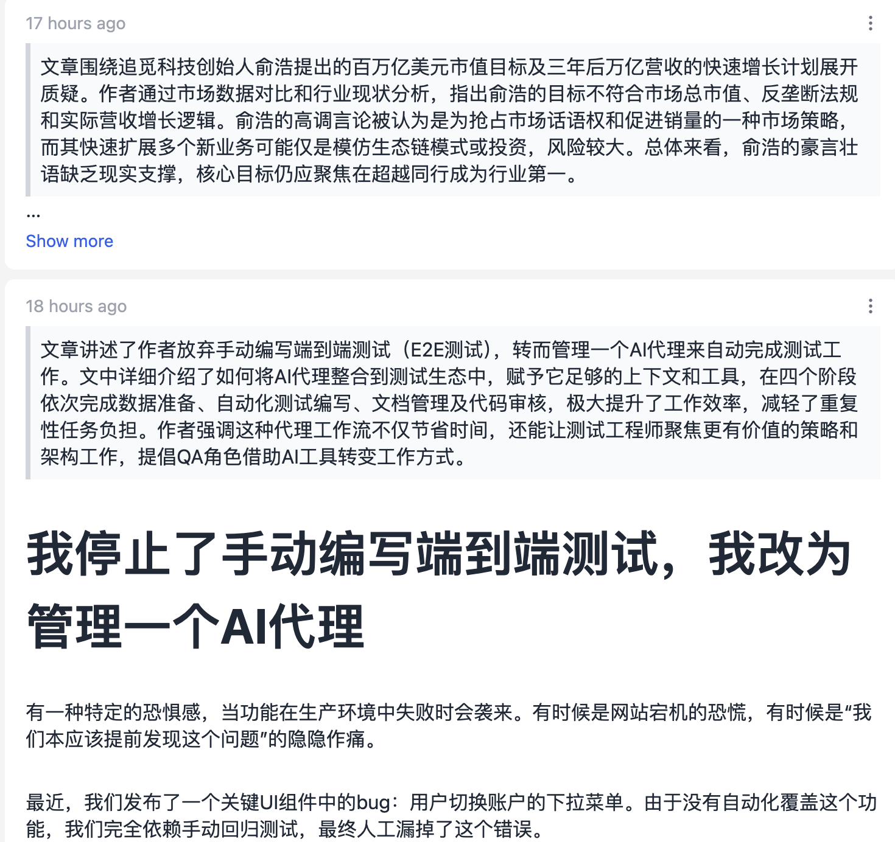

n8n，真正0代码、只需5分钟！ 就能打造第二大脑

<!--more-->

你是不是也这样：刷到一篇不错的内容想稍后看，结果收藏夹里堆了几百篇，却从来没有时间翻？

知识碎片到处都是，却始终形不成自己的“第二大脑”？

今天我带你用 n8n，真正0代码、只需5分钟！ 就能打造一个私人自动化系统：从webhook触发，到文章自动抓取, 再到AI智能摘要打标签, 最后永久保存进你的知识库，可搜索、可回顾、再也不怕“好东西”白收藏了！

全程拖拽节点、零基础也能上手，效率直接起飞～

废话不多说，直接开整！

## 依赖项

先看一下依赖项，笔记工具这里我用的是本地搭建的[memo](https://usememos.com/)，自带了api，跟n8n配合的很好。

## 实现思路

大家看这个流程图就很清楚了。



## 效果演示



## 总结

短短5分钟，我们就用n8n零代码搭建了一个超级实用的私人自动化系统。

有同学就要问了，为什么要这么折腾呢，直接用notion加浏览器插件不就好了吗？

notion是很好，只可惜内容是存在别人那里的，笔记只有存在本地才是自己的，才能成为你真正能搜索、能回顾的“第二大脑”！

从今天起，再也不用担心收藏了却没时间看，知识终于开始为你工作，而不是反过来。

欢迎在评论区分享你自己的知识库搭建方案。

喜欢的话点个赞、关注、加收藏，我们下期继续玩转更多n8n黑科技！

感谢观看，我们下次见！

## workflow 代码

```json
{
  "name": "x to memo",
  "nodes": [
    {
      "parameters": {
        "model": {
          "__rl": true,
          "mode": "list",
          "value": "gpt-4.1-mini"
        },
        "builtInTools": {},
        "options": {}
      },
      "type": "@n8n/n8n-nodes-langchain.lmChatOpenAi",
      "typeVersion": 1.3,
      "position": [544, 224],
      "id": "3ac944d2-21ec-45ee-8ca1-434e3da51b38",
      "name": "OpenAI Chat Model",
      "credentials": {
        "openAiApi": {
          "id": "BXY8zyriz6gA0iAp",
          "name": "OpenAi account"
        }
      }
    },
    {
      "parameters": {
        "schemaType": "manual",
        "inputSchema": "{\n  \"type\": \"object\",\n  \"properties\": {\n    \"summary\": {\n      \"type\": \"string\",\n      \"description\": \"对原文的核心内容进行较为详细的中文总结。需包含主要事实、关键观点、重要结论或转折点。信息密度较高，避免过于泛泛而谈或只有一句话。字数建议60–140字。\"\n    },\n    \"text_with_punctuation\": {\n      \"type\": \"string\",\n      \"description\": \"转成markdown格式，如果是英文，则进行翻译\"\n    }\n  },\n  \"required\": [\"summary\", \"text_with_punctuation\"],\n  \"additionalProperties\": false\n}\n"
      },
      "type": "@n8n/n8n-nodes-langchain.outputParserStructured",
      "typeVersion": 1.3,
      "position": [672, 224],
      "id": "5ada8866-3959-48a4-a547-a582e38fa033",
      "name": "Structured Output Parser"
    },
    {
      "parameters": {
        "method": "POST",
        "url": "http://192.168.50.199:5231/api/v1/memos",
        "authentication": "genericCredentialType",
        "genericAuthType": "httpBearerAuth",
        "sendBody": true,
        "bodyParameters": {
          "parameters": [
            {
              "name": "state",
              "value": "NORMAL"
            },
            {
              "name": "visibility",
              "value": "PRIVATE"
            },
            {
              "name": "relations",
              "value": "[]"
            },
            {
              "name": "location",
              "value": "{       \"placeholder\": \"\",       \"latitude\": 0,       \"longitude\": 0     }"
            },
            {
              "name": "content",
              "value": "=> {{ $json.output.summary }}\n\n{{ $json.output.text_with_punctuation }}\n\n原文地址: {{ $('设置URL').item.json.url }}"
            }
          ]
        },
        "options": {}
      },
      "type": "n8n-nodes-base.httpRequest",
      "typeVersion": 4.3,
      "position": [880, 0],
      "id": "c855bc87-8865-4b8f-9dc5-f1cdf42c2367",
      "name": "保存到memo",
      "credentials": {
        "httpBearerAuth": {
          "id": "bCy4GSlM1aheIAlH",
          "name": "Bearer Auth account"
        }
      }
    },
    {
      "parameters": {
        "path": "421f32a4-0b85-4cd4-99f3-9881899eb9fb",
        "options": {}
      },
      "type": "n8n-nodes-base.webhook",
      "typeVersion": 2.1,
      "position": [-144, 0],
      "id": "54fb7c6a-eb7a-4a0d-8a29-a3cae25f5016",
      "name": "Webhook",
      "webhookId": "421f32a4-0b85-4cd4-99f3-9881899eb9fb"
    },
    {
      "parameters": {
        "assignments": {
          "assignments": [
            {
              "id": "290ce417-a6df-4597-807b-10ea2ef6d72f",
              "name": "url",
              "value": "={{ $json.query.x }}",
              "type": "string"
            }
          ]
        },
        "options": {}
      },
      "type": "n8n-nodes-base.set",
      "typeVersion": 3.4,
      "position": [80, 0],
      "id": "a4b0a060-4257-426d-a2c7-fa6564c5e87d",
      "name": "设置URL"
    },
    {
      "parameters": {
        "url": "=https://r.jina.ai/{{ $json.url }}",
        "options": {}
      },
      "type": "n8n-nodes-base.httpRequest",
      "typeVersion": 4.3,
      "position": [304, 0],
      "id": "5a9aedaf-93d4-4759-b3a9-5b7e09c9d735",
      "name": "Call jina"
    },
    {
      "parameters": {
        "promptType": "define",
        "text": "=你是一个专业的文本整理写手。\n\n任务：\n1.转换成 Markdown 格式\n2. 不要改写原文意思，不要增删词语，只加标点、分段、加标签。\n3. 保持原文所有内容完整。\n\n输出必须是严格的 JSON，不要有任何前缀、后缀、markdown 包裹、解释文字：\n\n{\n  \"summary\": \"对整段内容的详细中文总结，包含主要事实、关键观点、说话人立场、重要结论等，信息密度较高，字数70–160字\",\n  \"text_with_punctuation\": \"这里是处理后的 Markdown 格式文本（如果是英文，则翻译成中文)，在文章的最后，提炼1-3个标签，标签的格式是:#标签1，#标签2，#标签3\"\n}\n\n现在处理以下转写文本：\n{{ $json.data }}\n",
        "hasOutputParser": true,
        "batching": {}
      },
      "type": "@n8n/n8n-nodes-langchain.chainLlm",
      "typeVersion": 1.9,
      "position": [528, 0],
      "id": "b4b57457-b5d4-4550-8104-a79ac64bcbda",
      "name": "文本整理"
    },
    {
      "parameters": {
        "content": "Get url from the webhook",
        "height": 256,
        "width": 224
      },
      "type": "n8n-nodes-base.stickyNote",
      "position": [16, -128],
      "typeVersion": 1,
      "id": "32a39390-ea5e-4cfa-8a6f-98e01c451853",
      "name": "Sticky Note"
    },
    {
      "parameters": {
        "content": "Calls Jina Reader (https://r.jina.ai/url) → gets clean, ad-free, LLM-ready markdown (works for most articles, blogs, docs, many PDFs, etc.)",
        "height": 256,
        "width": 224
      },
      "type": "n8n-nodes-base.stickyNote",
      "position": [256, -128],
      "typeVersion": 1,
      "id": "3255f6b3-674f-4a4a-a5cd-68010309d40c",
      "name": "Sticky Note1"
    },
    {
      "parameters": {
        "content": "LLM chain instructions:\n• Convert to well-structured Markdown\n• Add punctuation, logical paragraphs, headings if missing\n• If English → translate to Chinese\n• Write detailed Chinese summary (70–160 chars, high info density)\n• Append 1–3 relevant tags at the end (#tag1 #tag2)",
        "height": 288,
        "width": 224
      },
      "type": "n8n-nodes-base.stickyNote",
      "position": [528, -304],
      "typeVersion": 1,
      "id": "f102bd8b-5cf7-428c-a07d-00ee94f48ad3",
      "name": "Sticky Note2"
    },
    {
      "parameters": {
        "content": "POST to your local memos API\nContent format:\n\n{{summary}}<br><br>{{markdown text}}<br><br>原文地址: {{original url}}\nVisibility: PRIVATE\n",
        "height": 288,
        "width": 208
      },
      "type": "n8n-nodes-base.stickyNote",
      "position": [832, -304],
      "typeVersion": 1,
      "id": "9951ca7e-9d35-4400-93d2-ab96186f9887",
      "name": "Sticky Note3"
    }
  ],
  "pinData": {},
  "connections": {
    "OpenAI Chat Model": {
      "ai_languageModel": [
        [
          {
            "node": "文本整理",
            "type": "ai_languageModel",
            "index": 0
          }
        ]
      ]
    },
    "Structured Output Parser": {
      "ai_outputParser": [
        [
          {
            "node": "文本整理",
            "type": "ai_outputParser",
            "index": 0
          }
        ]
      ]
    },
    "Webhook": {
      "main": [
        [
          {
            "node": "设置URL",
            "type": "main",
            "index": 0
          }
        ]
      ]
    },
    "设置URL": {
      "main": [
        [
          {
            "node": "Call jina",
            "type": "main",
            "index": 0
          }
        ]
      ]
    },
    "Call jina": {
      "main": [
        [
          {
            "node": "文本整理",
            "type": "main",
            "index": 0
          }
        ]
      ]
    },
    "文本整理": {
      "main": [
        [
          {
            "node": "保存到memo",
            "type": "main",
            "index": 0
          }
        ]
      ]
    }
  },
  "active": true,
  "settings": {
    "executionOrder": "v1",
    "availableInMCP": false
  },
  "versionId": "8ccdabb7-039f-42f3-98ba-81e8b9a45759",
  "meta": {
    "templateCredsSetupCompleted": true,
    "instanceId": "ea88c21968cc5db85f3852738745083d909e06f82d93e8f23c557c663f940240"
  },
  "id": "9W4C14Uv4GKG4H1HnmgkA",
  "tags": []
}
```
